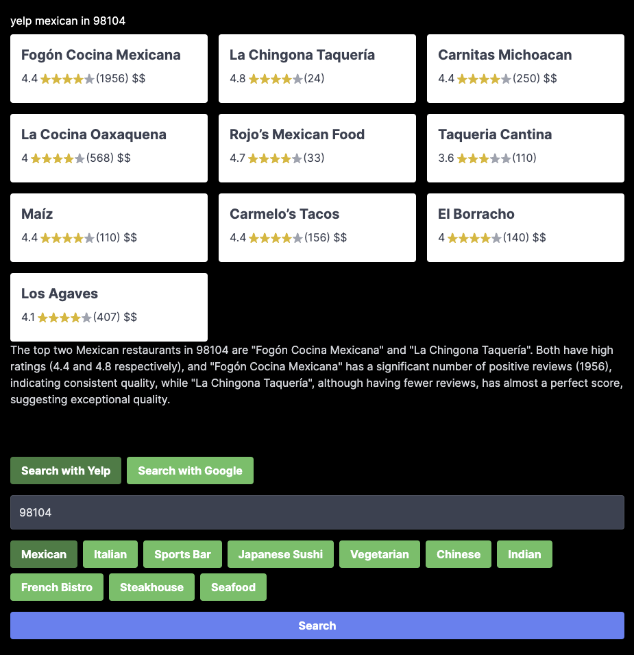

# dishcovery.eats

This is an experimental side project to explore using OpenAI/LLM functions alongside an API to create a hybrid search and chat experience. 

Currently uses SerpAPI which as access to both Google and Yelp for restaurant search. You can sign-up for an account here: https://serpapi.com/



## Usage

```
npm install
```

```
OPENAI_API_KEY=xxx SERP_API_KEY=xxx npm run dev
```